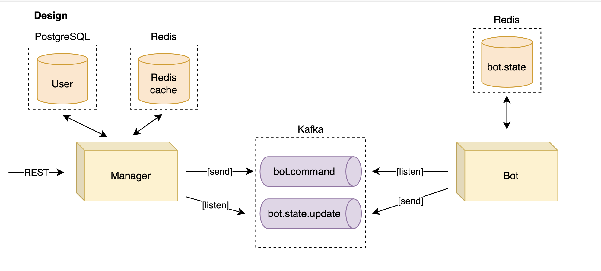
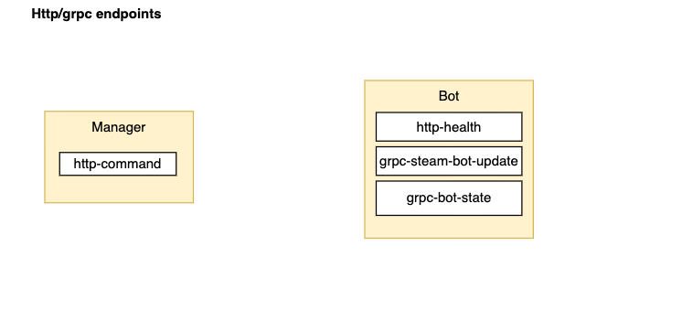
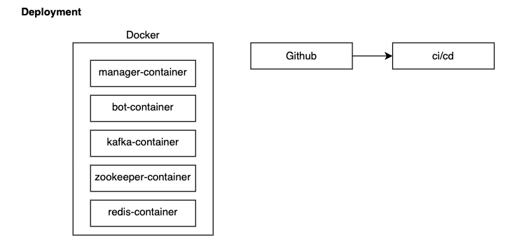

# Pet manager service

This is going to be a pet project for training the general stuff.

## Deployment
To deploy this project run
```bash
  docker build -t ghcr.io/batskel/pet-manager:latest .
  docker-compose -f deployment/docker/standalone.yaml --env-file deployment/docker/.env up 
```
To undeploy the project run
```bash
  docker-compose -f deployment/docker/standalone.yaml --env-file deployment/docker/.env down 
```

## Preliminary design


## Http/gRPC endpoints


## Deployment
